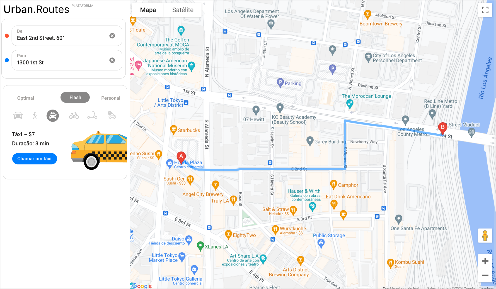

# Urban Routes

___
Urban Routes é uma plataforma interativa desenvolvida no Bootcamp da TripleTen. A plataforma oferece serviços de transporte urbano, permitindo que os usuários solicitem táxis e outros meios de transporte de forma rápida e eficiente. O projeto abrangeu a criação de uma interface funcional para o agendamento de viagens, incluindo a exibição de rotas e custos estimados.

**Testes que realizei:**

- **Mapa Mental:** Desenvolvi um mapa mental detalhado para a funcionalidade do formulário de solicitação de viagens, garantindo que todos os fluxos de trabalho fossem claramente definidos e compreendidos.
- **Checklist de Funcionalidades:** Elaborei um checklist abrangente dos requisitos para a tela "Status da Viagem", verificando se cada componente atendia aos critérios estabelecidos.
- **Validação de Campos:** Criei e executei testes específicos para validar os campos na tela "Solicitar Viagem", assegurando que as entradas do usuário fossem tratadas corretamente.
- **Testes de Funcionalidade:** Testei todas as funcionalidades da plataforma, não apenas utilizando checklists e tabelas, mas também revisando os designs e requisitos completos para garantir a consistência e a funcionalidade.
  
**Ferramentas que utilizei:**

- ***Xmind:*** Utilizado para criar o mapa mental, organizando visualmente as funcionalidades e fluxos de trabalho.
- ***Navegadores Web (Chrome, Opera):*** Utilizados para testar a interface e funcionalidades em diferentes ambientes e resoluções de tela.
- ***Jira:*** Utilizado para gerenciar e rastrear bugs encontrados durante os testes, facilitando a correção e o acompanhamento dos problemas.
- ***Figma:*** Ferramenta para revisar e testar o design da interface, garantindo que a implementação seguisse fielmente os requisitos visuais e de usabilidade.

O projeto Urban Routes exemplifica o conhecimento técnico adquirido no Bootcamp da TripleTen, destacando a importância de um processo de desenvolvimento orientado por testes para garantir a qualidade e a satisfação do usuário.
